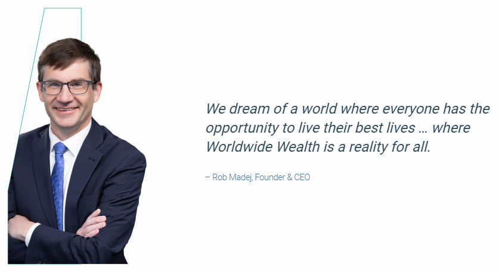
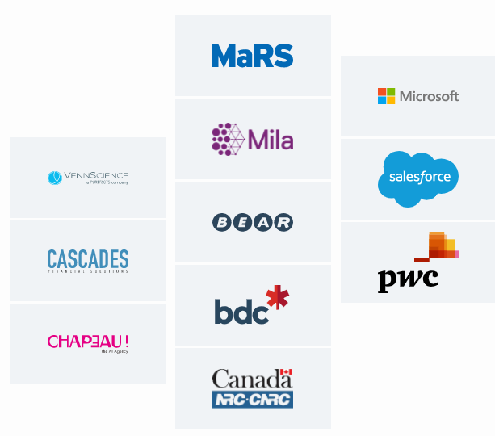
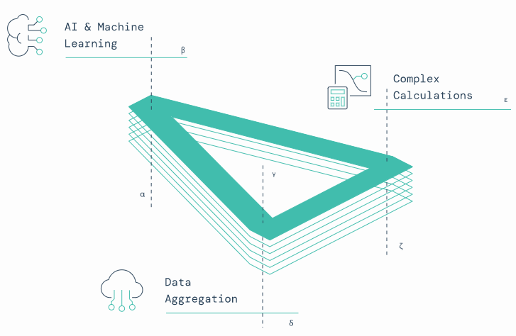
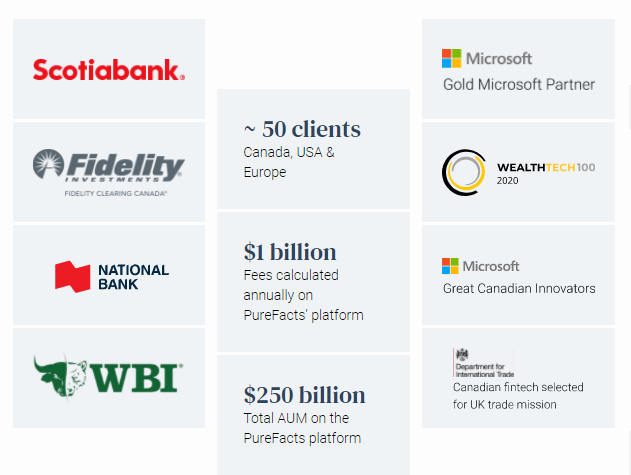
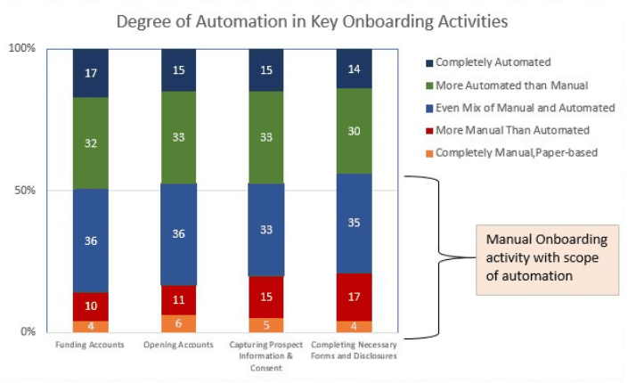

# Unit 1 Homework Assignment: FinTech Case Study
- - -

## PureFacts Financial 

  

#### Overview and Orign

PureFacts Financial Solutions is a private a company that was founded Rob Madej in 2010. The idea of the company came about when the founder found an opportunity to provide a service/product to calculate fees accurately and transparently. Rob Madej's first company was LynxDev which was incorporated in 1995. He had a client, Burgundy Asset Management which needed an efficient way of reporting and calculating fees. He saw a trend with other clients, and saw the opportunity to build a product that would solve similar problems for other firms and institutions.

They raised a total $20M from Scotiabank and Round 13 Capital. (Nov 2020)

They have also made 4 acquisitions:
* Quartel Financial Solutions for an undisclosed amount on November 17, 2020
* VennScience for an undisclosed amount on May 7, 2020
* Electric Brain Software Corporation for an undisclosed amount on Jun 1, 2019
* K2 Digital for an undisclosed amount on Nov 8, 2017 

  

---

#### Business Activities

PureFacts provides clients with transformational WealthTech solutions to future-proof their business and accelerate growth by leveraging expertise in wealth management data aggregation, complex calculations, Artificial Intelligence and machine learning.

##### 1) Demonstrating Value with Fee Transparency
The lack of transparency in the wealth management industry and the dissatisfaction of the fee structures is one of the root causes for investors discontent. Providing and ensuring a seamless feed into all statements and reports.

##### 2) Ensuring Compliance with a Holistic View of Clients
New regulatory rules and the framework of wealth firms are ever changing. Therefore as part of the compliance process, it is essential to have an overall view of each client. 

##### 3) Differentiate with Tailored Pricing
There are many alternatives investors have to access the markets. Like Robo-advisors and low-fee options. Many clients work up to five firms on average, and can be challenging to difficult to differentiate or consolidate assets. By recalibrating their pricing models and to communicate better to their valued clients. 

##### 4) Reduce Reputational Risk with Automation
Fees and billing is a risk function of any wealth firm. Many eros and undetected data anomalies can arise, which can cost a firm regulatory fines and damaged reputation. An automated system that eliminates any incorrect billing or fees and applies where necessary.

##### 5) Accelerate Growth with Scalable Tech Solutions
Businesses grow organically or through acquisitions. Acquisitions can lead to firms using outdated softwares or platforms that can affect productivity. Wealth firms can have scalable solutions to calculate their fees and handle suntions like portfolio management, risk management and CRM. 

The company’s intended customer or clientele is to help forward-thinking wealth management firms not only provide the best possible wealth advice, but also capture, grow and protect the value of that advice. Below are several clientele types:

* Large institutions (Wealth divisions within banks)
* Wealth management firms
* Boutique firms
* Broker/Dealers
* RIA (Registered Independent Advisors) in US
* Asset Management firms in US and Europe

  

PureFacts offers an industry-leading solution Fees & Billing Solution automates fee processing and revenue management to enable clients to demonstrate the value of their advice. 

###### Key features 
* To build trust with fee transparency
* Reduce back office cost
* Differentiate with tailored pricing 
* Manage risk with accurate daily calculations 

PureFacts uses three core competencies to offer solutions to its clients and stay competitive. By Using AI and Machine Learning, where a team of PhDs with wealth management knowledge who solve complex business problems with machine learning. Data aggregation is integrated with most wealth and asset management systems including portfolio management systems, book of records, CRM systems, and any other operational or investor facing systems within the firm. Lastly, handling complex calculations to calculate fee options or crushing large data for insights for more informed decisions.

PureFacts implements Machine Learning and AI to work together with human intelligence. PureFacts retention model helps to analyze patterns for clients at risk of leaving and flags them. Advisors can use this date to retain valuable clients. Using a predictive method wealth first can determine the long-term relationship and better manage the client’s lifecycle.  Detecting data anomalies by enabling wealth firms and their advisor to proactively identify errors and prevent costly mistakes. Advisors have the ability to talk with their data to make critical insights which are powered by AutoQL. The idea behind OOTB  is pulling data from different sources and combining them into two to three steps and deploying the out of the box value predictions and integrating repeated predictions. 

##### Aggregating Data with OOTB Accelerators 
Taking data from CRM systems like Salesforce to manage their own client base. Therefore, whatever tools advisors are using we PureFacts help them manage their clients. Using custodians where the official kind of source; the main book of records where the source of truth of where that account actually lives at the end of the day. Portfolio management systems or some wealth firms and advisors, that use a system to manage their clients portfolio. These advisors are able to do complex trading and combine general market data to make any complex trade.  

They do this by using the adapter method, just like any adapter for instance USB-C to HDMI adapter. If you have a MacBook and since there isn't an HDMI port, you can use the adapter to use an HDMI cable. Same concept, PureFacts, integrates with multiple systems, it has if they hold all the pieces in the middle and combine them all together and output it from one source.  Data mapping is making sure the system matches the data directly to where it needs to be, for example matching the first name coming from the CRM system will map directly to the first name of PureFacts system. PurFacts uses data enrichment to enrich data, for example taking individual data for multiple stocks and enriching and consolidating that data a view to customers of their holding in their portfolios. 

##### Deploying OOTB Value Proven Predictions

The second layer is by taking enriched and map data to deploy predictions for clients. Like investor retention prediction, a system for PureFacts clients to retain customers based on their rating percentage. For example if a client is 60% likely to leave. PureFacts solution can tell advisors of this information and give the opportunity to convince the client that everything is okay and to discuss any changes that may need to be made to their portfolio. Moreover, a customer value prediction that tells advisors how much assets’ their customers portfolio will increase with taking out outside factors and forecasting assets for and the possible contribution to the AUM to increase year over year.  This gives the advisors the ability to see how much each client’s value is and make sure to retain those high value clients.

Using data anomaly to detect any finding that looks like an outlier from the data. Therefore, if anything seems to look the system will detect that and inform the system of the issue being ‘okay’ or ‘not okay’. Any recurring issues that arise, the solution will know what to bypass or ask for permission and learn as it goes. Using various AI models, it all boils down to statistics and numbers that look at past trends and correlations to make the best model for each client. 

  

#### Landscape

PureFacts is is in the domain of Enterprise Software for Wealth Management firms. The wealth management industry has had many changes and dynamics through an increase of technology. We see a rise of convergence of banking and investing and the rise of fee-based managed accounts. According to McKinsey research, in 2000, the North American wealth management industry totaled 13 trillion dollars in client assets. In the next ten years it has increased by 45 percent, ammunting to 19 tillion dollar. with a profit margin of 16 bps in 2010. There were about 420,000 advisors in the US and Canada in 2010. By 2018, client assets rose 64 percent compared to 2010, reaching about $30.5 trillion, and margins improved to 18 bps. With the evolution of changes in the economy, in the last ten years the global data volume has increased from 2 zettabytes in 2010 to 41 zettabytes in 2019. 

The industry has more room to evolve as we see a drastic change in consumers. There are women who control more assets and with Millennials and Gen Xers have the ability to use digital tools to access information and make profound decisions to make new ways for protection and retirement planning. There is an increasing trend of online brokerages and aspects of convenience. It is boiling down to a simple interface with minimal activity required. Rapid technological progress, machine learning and AI are able to take big data and reshape for that specific client. Enabling to bring automation and efficiency by changing the work performed by humans.

  

##### 1) Addepar
Addepar is a wealth management platform that specializes in data aggregation, analytics and performance reporting. Addepar is able to aggregate all financial accounts and investments to enhance them relevant to the market and use third-party data to provide a view of clients’ across institutions. Providing an intuitive user experience to enable users to visualize and communicate relevant insights to clients.

##### 2) Croesus
Founded in 1987, Croesus is a FinTech offering easy to use wealth management solutions. The company draws on expertise and know-how to provide products and services tailored to the needs of the financial services industry. To provide their clients with an unparalleled experience, Croesus actively listens, learns, and engages with them to develop technology solutions that are innovative, flexible, and secure. Portfolio management solutions maximize efficiency, and data analysis tools allow financial services professionals to make informed decisions.

---

#### Results

PureFacts has been able to disrupt the Wealth Management domain and have made an impact with their solutions. They are able to provide transparency that go beyond regulatory requirements and in turn have had a loyal and trustworthy clientele. They are able to deliver statements and reports to their customers for firms to focus on retaining clients and manage that relationship.

Impacting the minimization of high risk errors which can lead to revenue leakage and regulatory fines. This helps to manage the risk and control back office costs. As the clients business evolves so does PureFacts solutions to handle fee structures and billing methods. The billing solution is able to adapt with the advisor’s platform to run the business the way the advisor wants.

Impacting CRM projects and using data to help build a frictionless, client-centric solution across a firm’s cliente. By implementing integrated wealth management and CRM data, PureFacts is able to extract data to obtain a 360 degree for its client’s customers. Regardless of the system used by firms (Salesforce, Microsoft 360, or Hubsoft), it is focused on providing a user-friendly experience for employers and advisors and most importantly their clients.

The Enterprise Software and Wealth Management domain is a domain that offers various solutions to wealth management and enterprise firms. There are few ways to measure the success of firms. Based on assets under management (AUM). AUM is the total number of market value investments that a person or entity manges on behalf of clients. PureFacts has been able to provide a total of over $1 billion fees that are amounted and calculated on their platform every year. 

Success can also be measured on how effective and efficient systems are. PureFacts’ clients have never been fined by regulators for incorrectly charging client fees. This goes to show that PureFacts is able to adapt to all or any compliances and help continue to increase value to clients. Out of the top 50 Canadian Advisors, 60 percent of them use PureFacts solutions for them to accurately calculate fees and prevent revenue leakages. PureFacts has provided over 1 million reports created annually for their client’s customers to understand their financial wellness.

PureFacts’s augmented solution which uses AI and Machine Learning only takes about 10 weeks to implement, instead of on average 12 months for related machine learning prediction solutions. Furthermore, there is $0 R&D expense to clients as PureFacts has a menu of out-of-the-box solutions ready to be implemented. 

Related to the competitors PureFacts is still a fairly new company, and its strong focus of using AI and Data Augmentation makes their product very competitive and innovative. Based on the couple competitors  mentioned above, they are still smaller in size but with recent acquisitions they have increased their team size to about 110 employees. Furthermore they have increased their funds with the recent acquisitions and are now focusing on organic growth.

---

#### Recommendations

As competition in the wealth management industry is getting heated, as many firms are focusing on growing by acquiring new clients, increasing the share from existing clients or enlarging Salesforce. These growth strategies surround them in servicing holistic needs by bettering the client experience at each interaction through the relationship cycle, specifically focusing on the initial interaction. Client onboarding in the simplest way is the process of bringing on a new client to your business. If done right can ensure a more deeper and profitable relation with clients.

The desire for growth and the digital revolution has led wealth management fires to focus their entail investment on client onboarding. An opportunity arises to increase operational efficiency by streamlining administrative tasks and a paperless environment. Furthermore, due to recent regulatory demands firms need to be more proactive on knowing their clients and laying down the groundwork for tailored client relationships. I would suggest PureFacts to expand into an onboarding solution for its clients.

  

PureFacts can benefit from adding this solution as this can help to lay out the groundwork for the firm and to keep a long-term relationship with clients. It will improve the cost-to-income ratio by transforming the onboarding process from a cost center to a source of revenue, improving efficiency by scaling up and using analytic insights to amplify collaboration throughout departments. Unlocking a unique client opportunity by creating a tangible and frictionless touchpoint with clients to build customer loyalty and retention. This will optimize existing business and an opportunity for cross-selling other solutions. 

Using AI and Machine Learning and robotic process automation can make the process as quickly as possible. Ideally having a solution that can oversee client onboarding for the entire organization as quickly and seamlessly as possible. The more automation the better as automation increases speed and efficiency. Automation processes reduce the chances for errors and limit and security risks, which draws back to compliance.  

---

### Bibliography

* [https://www.croesus.com/about-us/](https://www.croesus.com/about-us/)

* [https://www.addepar.com/why-addepar](https://www.addepar.com/why-addepar)

* [https://www2.deloitte.com/content/dam/Deloitte/ch/Documents/financial-services/ch-fs-en-innovation-in-private-banking-and-wealth-management.pdf](https://www2.deloitte.com/content/dam/Deloitte/ch/Documents/financial-services/ch-fs-en-innovation-in-private-banking-and-wealth-management.pdf)

* [https://www.purefacts.com/hubfs/PureFacts%20-%20Fee%20Transparency%20White%20Paper.pdf?hsLang=en](https://www.purefacts.com/hubfs/PureFacts%20-%20Fee%20Transparency%20White%20Paper.pdf?hsLang=en)

* [https://www.purefacts.com/client-enterprise-reporting](https://www.purefacts.com/client-enterprise-reporting)

* [https://www.purefacts.com/insights/financing-round](https://www.purefacts.com/insights/financing-round)

* [https://www.purefacts.com/augmented-intelligence-solutions](https://www.purefacts.com/augmented-intelligence-solutions)

* [https://www.theglobeandmail.com/investing/globe-advisor/advisor-news/article-welcome-to-wealth-management-20/](https://www.theglobeandmail.com/investing/globe-advisor/advisor-news/article-welcome-to-wealth-management-20/)

* [https://www.accenture.com/us-en/~/media/Accenture/Conversion-Assets/DotCom/Documents/Global/PDF/Industries_12/Accenture-Redefining-Wealth-Management-Client-Onboarding.pdf](https://www.accenture.com/us-en/~/media/Accenture/Conversion-Assets/DotCom/Documents/Global/PDF/Industries_12/Accenture-Redefining-Wealth-Management-Client-Onboarding.pdf)

* [https://www.finextra.com/blogposting/17884/why-wealth-managers-need-effective-client-onboarding](https://www.finextra.com/blogposting/17884/why-wealth-managers-need-effective-client-onboarding)

* [Scanning the FinTech Landscape: 10 Disruptive Models, McKinsey & Company](https://www.mckinsey.com/industries/financial-services/our-insights/banking-matters/scanning-the-fintech-landscape)

* [https://www.appway.com/screen/OnboardingForWealth](https://www.appway.com/screen/OnboardingForWealth)

---

